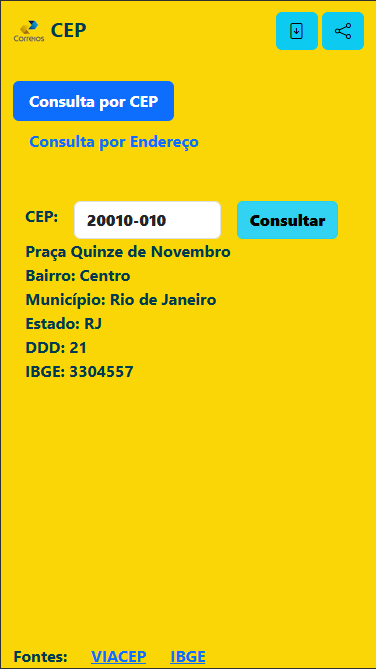
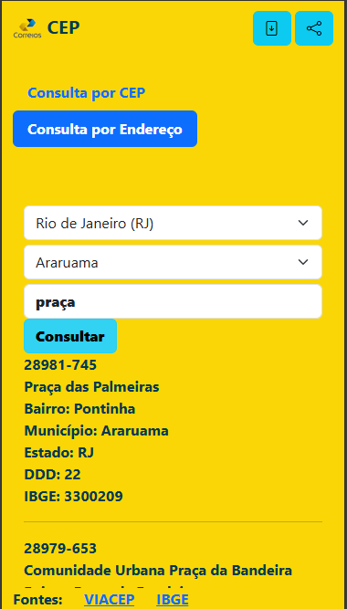

## CEP

Esse é um aplicativo que utiliza HTML5, CSS e Javascript para consultar o CEP consumindo VIACEP

Abra [CEP](https://paulorobertoalexandresilva.github.io/cep/) no seu `navegador` para ver o resultado

#### imagens

